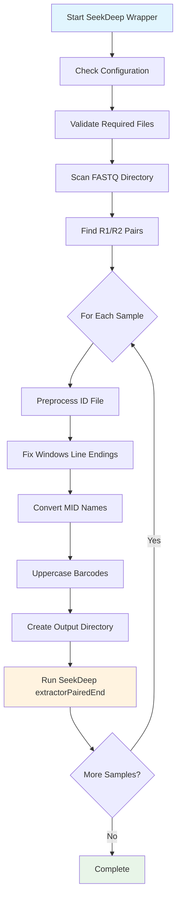
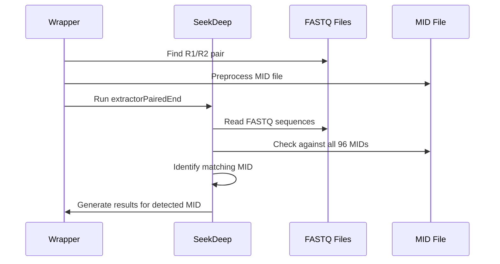

# SeekDeep Easy Wrapper - User Guide

## Overview

The SeekDeep Easy Wrapper (`seekdeep_wrapper.sh`) is a zero-configuration script that makes SeekDeep accessible to non-technical users. It automatically processes all FASTQ file pairs in a directory, handles common file formatting issues, and organizes results in a clear structure.

## What This Wrapper Does

### Core Functionality
- **Automatic File Discovery**: Scans for all R1/R2 FASTQ pairs in your raw data directory
- **Format Handling**: Fixes Windows line endings, barcode casing, and MID naming conventions
- **Batch Processing**: Processes multiple samples automatically
- **Result Organization**: Creates organized output directories for each sample
- **Error Handling**: Provides clear feedback on issues and progress

### Key Benefits
- **Zero Configuration**: No command-line arguments needed - just run it!
- **Robust**: Handles common file format issues automatically
- **User-Friendly**: Clear progress indicators and error messages
- **Organized Output**: Results are neatly organized by sample

## Workflow Diagram



## Directory Structure

### Input Structure
```
SeekDeep/
├── seekdeep_wrapper.sh           # Main wrapper script
├── extractor_input/
│   ├── idFile_nyny.txt           # MID/barcode definitions
│   ├── overlap_statusny.txt      # Overlap status file
│   └── raw_fastq/                # Raw FASTQ files
│       ├── 1000_S1360_R1_001.fastq.gz
│       ├── 1000_S1360_R2_001.fastq.gz
│       ├── 1043_S1361_R1_001.fastq.gz
│       ├── 1043_S1361_R2_001.fastq.gz
│       └── ...
└── bin/
    └── SeekDeep                  # SeekDeep binary
```

### Output Structure
```
seekdeep_results/
├── 1000_S1360/                  # Sample 1000_S1360
│   ├── extractionProfile/
│   ├── filtered/
│   ├── logs/
│   └── ...
├── 1043_S1361/                  # Sample 1043_S1361
│   ├── extractionProfile/
│   ├── filtered/
│   ├── logs/
│   └── ...
└── ...
```

## Technical Details

### Sample Processing Logic

The wrapper follows this logic for each sample:

1. **Sample Definition**: Each R1/R2 FASTQ pair represents one sample that was sequenced with one specific MID (barcode pair)

2. **Demultiplexing**: SeekDeep receives the complete MID reference file (96 MIDs) and automatically determines which MID each sample corresponds to based on the barcodes found in the FASTQ files

3. **Single Processing**: Each sample is processed once with the full MID file - SeekDeep handles the demultiplexing internally



### ID File Preprocessing

The wrapper automatically handles these common issues:

#### Windows Line Endings
- **Problem**: Files created on Windows have `\r\n` line endings
- **Solution**: Converts to Unix `\n` format using `dos2unix` or `sed`

#### MID Naming Convention
- **Problem**: Original files may have `MID1, MID2, MID3`
- **Solution**: Converts to `MID001, MID002, MID003` format

#### Barcode Case Sensitivity
- **Problem**: Mixed case barcodes may cause issues
- **Solution**: Converts all barcodes to uppercase

#### Example Transformation
```
# Original Format
ID	BARCODE	BARCODE2
MID1	tagcgttg	cagtacta
MID2	tagtggga	cagtacta

# Processed Format
ID	BARCODE	BARCODE2
MID001	TAGCGTTG	CAGTACTA
MID002	TAGTGGGA	CAGTACTA
```

## Usage

### Prerequisites
1. SeekDeep compiled and binary available at `./bin/SeekDeep`
2. FASTQ files in `extractor_input/raw_fastq/`
3. ID file at `extractor_input/idFile_nyny.txt`
4. Overlap file at `extractor_input/overlap_statusny.txt`

### Running the Wrapper
```bash
# Navigate to SeekDeep directory
cd /path/to/SeekDeep

# Run the wrapper (no arguments needed!)
./seekdeep_wrapper.sh
```

### Configuration
All configuration is at the top of the script:
```bash
ID_FILE="extractor_input/idFile_nyny.txt"
OVERLAP_FILE="extractor_input/overlap_statusny.txt"
FASTQ_DIR="extractor_input/raw_fastq"
OUTPUT_BASE="seekdeep_results"
```

## Expected File Naming

### FASTQ Files
- **Format**: `{SAMPLE}_R1_001.fastq.gz` and `{SAMPLE}_R2_001.fastq.gz`
- **Example**: `1000_S1360_R1_001.fastq.gz` and `1000_S1360_R2_001.fastq.gz`

### ID File Format
```
TARGET	FORWARD	REVERSE
CSP	AAATGACCCAAACCGAAATGT	GGAACAAGAAGGATAATACCA
...

ID	BARCODE	BARCODE2
MID001	TAGCGTTG	CAGTACTA
MID002	TAGTGGGA	CAGTACTA
...
```

## Error Handling

The wrapper provides clear error messages for common issues:

- **Missing files**: Checks for required files and provides specific error messages
- **SeekDeep failures**: Reports when SeekDeep processing fails for a sample
- **Format issues**: Automatically fixes common format problems
- **Progress tracking**: Shows current sample being processed

## Troubleshooting

### Common Issues

1. **SeekDeep binary not found**
   - Ensure SeekDeep is compiled: `make`
   - Check binary location: `ls -la ./bin/SeekDeep`

2. **No FASTQ files found**
   - Check file naming convention
   - Verify files are in `extractor_input/raw_fastq/`

3. **ID file format issues**
   - Wrapper auto-fixes most issues
   - Check original file has TARGET and ID sections

4. **Memory issues**
   - Large datasets may require more memory
   - Consider processing smaller batches

### Debugging
Enable detailed output by adding debug flags to the SeekDeep command in the script:
```bash
./bin/SeekDeep extractorPairedEnd --verbose --debug ...
```

## Comparison with Manual Workflow

| Aspect | Manual Workflow | Wrapper Workflow |
|--------|----------------|------------------|
| **File Discovery** | Manual selection of each R1/R2 pair | Automatic scanning of directory |
| **Format Handling** | Manual fixing of line endings, case, etc. | Automatic preprocessing |
| **Batch Processing** | Run command for each sample individually | Automatic processing of all samples |
| **Error Handling** | Manual debugging of each failure | Clear error messages and progress |
| **Result Organization** | Manual organization of outputs | Automatic directory structure |
| **User Experience** | Requires technical knowledge | Zero-configuration for end users |

## Future Enhancements

Potential improvements for future versions:

1. **fastp Integration**: Optional quality trimming before SeekDeep
2. **Parallel Processing**: Process multiple samples simultaneously
3. **Resume Capability**: Skip already processed samples
4. **Custom Naming**: Flexible file naming pattern support
5. **Quality Reports**: Generate summary statistics across all samples

## Contributing

When making changes to the wrapper:

1. **Test thoroughly** with various file formats and naming conventions
2. **Update documentation** to reflect changes
3. **Preserve zero-configuration** philosophy
4. **Add clear error messages** for new failure modes
5. **Maintain backward compatibility** where possible

## Technical Notes

### SeekDeep Command Used
```bash
./bin/SeekDeep extractorPairedEnd \
    --fastq1 "$r1_file" \
    --fastq2 "$r2_file" \
    --idFile "$preprocessed_id_file" \
    --overlapStatusFnp "$OVERLAP_FILE" \
    --outDir "$output_dir" \
    --overWriteDir
```

### File Processing Details
- **Line ending detection**: Uses `hexdump` to detect Windows line endings
- **BOM handling**: Removes UTF-8 Byte Order Mark if present
- **MID processing**: Uses `awk` for reliable field processing
- **Cleanup**: Removes temporary files after processing

This wrapper represents a significant improvement in usability while maintaining the full power and accuracy of SeekDeep's analysis capabilities.
